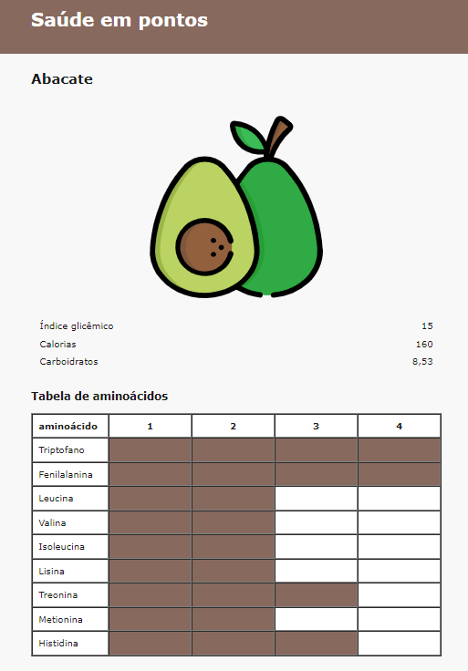

# Aula 6 - Layout parte 2

Sem enrolação, vamos ver como conseguimos pegar todo conhecimento adquirido até a aula 5 e criar uma página mais ou menos bonita. Para crias esses layouts em código, vamos utilizar tabelas, uma prática muito comum de estruturar uma página (por volta do ano 2000).

> Brincadeiras a parte, fique tranquilo quanto a isso de estar usando coisas antiquadas, nada do que você aprender aqui é inútil, muito pelo contrário, todos os conhecimentos até agora são elementares. Algum momento você irá juntar tudo que aprendeu e perceberá o que pode fazer "a la Karate Kid".

Então lhes apresento a tabela:

```html
<table>
  <tr>
    <td>isso é uma coluna</td>

    <td>isso é outra coluna</td>
  </tr>
</table>
```

Explicando os elemntos acima:

- `table` significa mesa em inglês (the book is on the table) ou tabela que faz mais sentido nesse caso.
- `tr` é a sigla para "table row", ou seja, "linha da tabela".
- `td` é a sigla para "table data", traduzindo são os dados da tabela, o que podemos entender como uma coluna normal de conteúdo.

Se quisermos que nossa tabela tenha mais linhas, basta criar outros `<tr>` com a mesma quantidade de `<td>` dentro.

```html
<table>
  <tr>
    <td>primeira coluna da primeira linha</td>

    <td>segunda coluna da primeira linha</td>
  </tr>

  <tr>
    <td>primeira coluna da segunda linha</td>

    <td>segunda coluna da segunda linha</td>
  </tr>
</table>
```

Agora temos tudo para começar. Então como eu tinha mencionado em aulas anteriores, o designer manda para nós como ele quer a página e nós vamos lá no nosso editar de texto espressar isso em código. Abaixo o layout que vamos seguir:



Já pode começar como que você já sabe:

1. rascunhar o grid
2. criar o arquivo .html
3. escrever a estrura básica

Cada seção do layout nós trataremos como uma nova tabela, pois têm características que diferem das outras, como cor do fundo, bordas e espaçamentos. Assim as seções possui sua definição de quantas linhas e colunas precisa.

Olhando para a primeira seção, vou começar analisando o grid e te dizer o que vejo. Vejo 3 colunas, onde a primeira e a última são só colunas vazias do mesmo tamanho para centralizar a coluna do meio que é onde vai o conteúdo. Então temos as três colunas assim:

ˋˋˋhtml
<table>
  <tr>
    <td></td>

    <td>Saúde em pontos</td>

    <td></td>
  </tr>
</table>
ˋˋˋ

Agora precisamos pensar nos tamanhos. A seção ocupa 100% da largura da página, já a coluna do meio, seguindo o layout tem 720px (explico abaixo sobre px) de largura. Para definirmos esses valores precisamos utilizar um outro atributo HTML chamado "width" que em inglês significa "largura". Há duas formas de utilizar ele:

1. Passando só o valor, assim será aceito como píxel. ˋwidth="720"ˋ
2. Escrevendo % no final para medidas percentuais. ˋwidth="50%"ˋ

<details>
  <summary>saiba mais sobre píxels (px)</summary>

  Píxel é a unidade de medida mais comum na computação e em design digital. Em vários lugares vemos os píxels sendo mencionados e usados. Uma câmera de 32 megapíxels provavelmente (não sei muito disso) é uma câmera que captura 32 milhões de píxels em uma foto. Um sinal de TV HD das tvs digitais é de no mínimo 720px de altura. Um monitor full HD tem no mínimo 1080px de altura. São muitos exemplos de telas e elementos delas que são definidos em píxels.
</details>

ˋˋˋhtml
<table width="100%">
  <tr>
    <td></td>

    <td width="720">Saúde em pontos</td>

    <td></td>
  </tr>
</table>
ˋˋˋ

Outro atributo que vamos usar é o "bgcolor" que significa "background color", cor de fundo em português. Aí só passar a cor em algum formato, talvez isso de formatos seja um conceito novo também, então vou descrever abaixo se quiser ler. Se não, pode só usar o valor "#87695e" que estou te passando que é o marrom da cor de fundo da primeira seção.

<details>
  <summary>veja mais sobre formatos de cores</summary>

  Vou te passar as três formas que mais importam agora no começo para você ir usando.

  - **por nome:** Veja as cores por nome como chegar no loja de tintas e pedir por uma tinta que já está pronta, não haverá todas as cores, mas se tu não for muito exigente, talvez tenha uma que já te sirva.
  A lista de cores predefinidas e nomeadas você pode [consultar no site do w3](https://www.w3schools.com/tags/ref_colornames.asp)
  - **formato hexadecimal:** Sabe aquele conhecimento que parecia inútil no tempo de escola e você perguntava pra que vou usar isso? Pois bem, a contagem hexadecimal é usada nas cores no meio digital e é a mais comum até hoje, tanto que a cor que te passei para usar é nesse formato também. O formato hexadecimal se escreve começando com # e depois os pares de valores hexadecimais que vão de 0 até f. Ou seja 0, 1, 2, 3, 4, 5, 6, 7, 8, 9, a, b, c, d, e, f. Não vou mais tanto no detalhe, se quiser saber mais [dê uma lida no site do w3 schools.](https://www.w3schools.com/css/css_colors_hex.asp)
  - **formato RGB:** Se assemelha muito ao hexadecimal, porém os números são decimais e envolvido pelo texto "rgb()". Esse formato é usado no Paint do Windows. O azul em RGB é ˋrgb(0, 0, 255)ˋ, onde os primeiro zero é do R (red = vermelho), o segundo zero G (green = verde) e o último número 255 que é o valor máximo de azul.
</details>

ˋˋˋhtml
<table bgcolor="#87695e" width="100%">
  <tr>
    <td></td>

    <td width="720">Saúde em pontos</td>

    <td></td>
  </tr>
</table>
ˋˋˋ

É tanto conceito que estou constrangido de te mostrar mais esse, mas precisamos para seguir. Uma coisa que não falei muito é sobre os espaçamentos e exitem 2 que são usados na web.

1. **margin:** a margem são espaçamentos externos que usamos para separar um elemento de outro.
2. **padding:** o preenchimento (todo mundo chama de padding) é o espaçemento interno, é muito usado quando queremos aumentar o tamanho dos elementos em tela.

É justamente o padding que precisamos aqui, pois queremos dar uma "encorpada" na altura do header, nossa primeira seção. Se usássemos a margem o espaçamento externos não iria aumentar a altura do fundo marrom.

ˋˋˋhtml
<table bgcolor="#87695e" width="100%" cellspacing="20">
  <tr>
    <td></td>

    <td width="720">Saúde em pontos</td>

    <td></td>
  </tr>
</table>
ˋˋˋ

ˋˋˋhtml
<table bgcolor="#87695e" width="100%" cellspacing="20">
  <tr>
    <td></td>

    <td width="720">
      <h1>
        <font color="white">Saúde em pontos</font>
      </h1>
    </td>

    <td></td>
  </tr>
</table>
ˋˋˋ